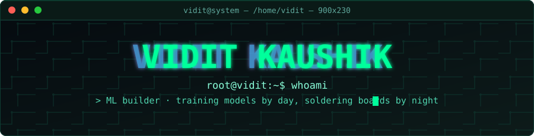

<div align="center">



<br/>


[](https://www.linkedin.com/in/vidit-kaushik/)
[](https://github.com/viditkaushik)


</div>

### `$ ./system_info.sh`

```yaml
name        : Vidit Kaushik
role        : ML Builder / Systems Tinkerer
focus       : Machine Learning · Data · Hardware · "crazy stuff"
status      : compiling ideas at 3am
philosophy  : "if it doesn't break, you didn't push it far enough"
```

<div align="center"></div>

### `$ ls ./stack/`

<div align="center">


</div>

<div align="center">

`Python` &nbsp;·&nbsp; `PyTorch` &nbsp;·&nbsp; `TensorFlow` &nbsp;·&nbsp; `scikit-learn` &nbsp;·&nbsp; `OpenCV` &nbsp;·&nbsp; `Pandas / NumPy`
`Arduino` &nbsp;·&nbsp; `Raspberry Pi` &nbsp;·&nbsp; `Embedded Systems` &nbsp;·&nbsp; `Linux` &nbsp;·&nbsp; `Docker` &nbsp;·&nbsp; `Git`

</div>

<div align="center"></div>

### `$ cat manifesto.md`

```
> most people write code.
> I train it, feed it data at 2am,
> wire it to a breadboard, and hope
> it doesn't catch fire.
>
> ML models by day, hardware hacks by night,
> and the occasional experiment that
> should probably stay off GitHub.
```

<div align="center"></div>

### `$ ./stats --live`

<div align="center">



</div>

<sub>⚠️ the numbers above are a styled static snapshot — swap in your real totals from the widgets below, or edit `assets/dashboard.svg` directly.</sub>

<div align="center">


</div>

<div align="center"></div>

### `$ ./hardware_selftest.sh --verbose`

<div align="center">


</div>

<div align="center"></div>

### `$ ./trophies --unlock`

<div align="center">


</div>

<div align="center"></div>

### `$ ./connect.sh --socials`

<div align="center">

[](https://www.linkedin.com/in/vidit-kaushik/)
[](https://github.com/viditkaushik)

</div>

<div align="center">

```
$ echo "thanks for stopping by"
> thanks for stopping by
$ █
```

</div>


